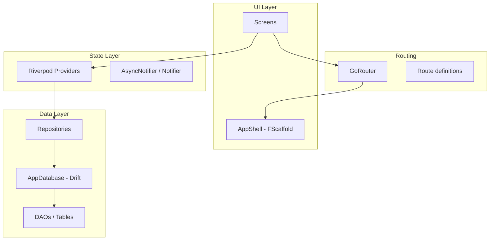
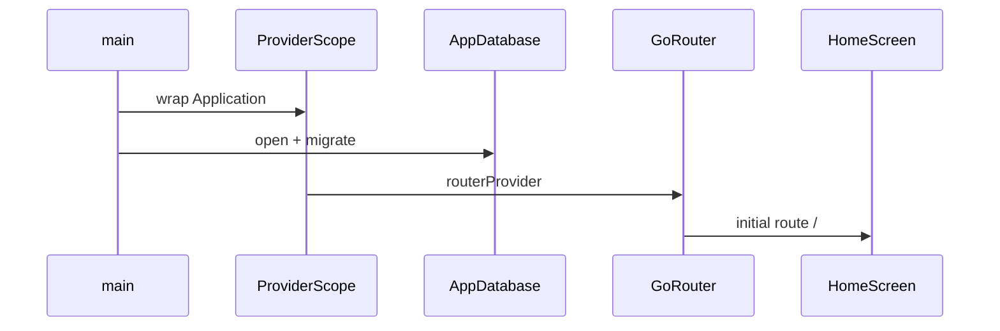

# Sprint 1: Core Router + SQLite

## Mục tiêu sprint

Xây **nền tảng** (không phải feature đầy đủ): app khởi động được, điều hướng giữa các màn hình qua `go_router`, đọc/ghi SQLite qua Drift, inject dependency qua Riverpod — tất cả tích hợp với ForUI hiện có trong [`lib/main.dart`](../../lib/main.dart).

## Kiến trúc tổng quan



**Luồng khởi động:**



## Quyết định đã chốt

| Hạng mục | Lựa chọn |
|----------|----------|
| Router | `go_router` |
| SQLite | `drift` + `drift_dev` + `sqlite3_flutter_libs` |
| State | `flutter_riverpod` + `riverpod_annotation` (optional gen) |
| UI shell | `FScaffold` + `FBottomNavigationBar` (mobile) / `FSidebar` (desktop) |

## Cấu trúc thư mục đề xuất

```
lib/
├── main.dart                    # entry: ProviderScope + runApp
├── app.dart                     # MaterialApp.router + ForUI wrappers
├── router/
│   ├── app_router.dart          # GoRouter config
│   └── routes.dart              # path constants + route names
├── core/
│   └── database/
│       ├── app_database.dart    # @DriftDatabase
│       ├── app_database.g.dart  # generated
│       ├── tables/              # table definitions
│       └── daos/                # optional DAO classes
├── data/
│   └── repositories/            # wrap Drift queries
├── providers/
│   ├── database_provider.dart   # singleton AppDatabase
│   └── repository_providers.dart
├── features/
│   ├── home/
│   │   └── home_screen.dart
│   ├── items/                   # màn hình demo CRUD SQLite
│   │   ├── items_screen.dart
│   │   └── items_provider.dart
│   └── settings/
│       └── settings_screen.dart
└── shell/
    └── app_shell.dart           # bottom nav / sidebar + child
```

## Dependencies cần thêm

[`pubspec.yaml`](../../pubspec.yaml):

```yaml
dependencies:
  flutter_riverpod: ^2.x
  go_router: ^14.x
  drift: ^2.x
  sqlite3_flutter_libs: ^0.5.x
  path_provider: ^2.x
  path: ^1.x

dev_dependencies:
  drift_dev: ^2.x
  build_runner: ^2.x
```

## Chi tiết từng hạng mục

### 1. Bootstrap app (`main.dart` → `app.dart`)

Tách logic ForUI từ [`lib/main.dart`](../../lib/main.dart) sang `app.dart`:

- `main()`: `WidgetsFlutterBinding.ensureInitialized()` → `runApp(ProviderScope(child: Application()))`
- `Application`: giữ nguyên pattern `FTheme` + `FToaster` + `FTooltipGroup`, thay `home:` bằng:

```dart
MaterialApp.router(
  routerConfig: ref.watch(routerProvider),
  // ... supportedLocales, theme, builder giữ nguyên
)
```

`routerProvider` là `Provider<GoRouter>` đọc `ref.watch(databaseProvider)` nếu cần redirect theo DB state sau này.

### 2. GoRouter — route map

| Path | Màn hình | Ghi chú |
|------|----------|---------|
| `/` | `HomeScreen` | initial route |
| `/items` | `ItemsScreen` | demo list từ SQLite |
| `/items/:id` | `ItemDetailScreen` | deep link + back stack |
| `/settings` | `SettingsScreen` | placeholder |

**Shell route** (`ShellRoute`): bọc 3 tab chính (`/`, `/items`, `/settings`) trong `AppShell` — `child` của shell là `navigationShell` từ `StatefulShellRoute.indexedStack` (giữ state từng tab).

```dart
// routes.dart
abstract final class AppRoutes {
  static const home = '/';
  static const items = '/items';
  static const settings = '/settings';
}
```

Navigation: `context.go(AppRoutes.items)` hoặc `context.push('/items/$id')`.

### 3. AppShell — ForUI navigation

[`AppShell`](../../lib/shell/app_shell.dart) nhận `StatefulNavigationShell navigationShell`:

- **Mobile** (`android`, `iOS`): `FScaffold` + `FBottomNavigationBar` — `onChange: navigationShell.goBranch`
- **Desktop** (`macOS`, `windows`): `FScaffold` + `FSidebar` — cùng branch index

Không tạo `FScaffold` lồng trong từng screen con — chỉ shell có scaffold, screen con render nội dung.

### 4. Drift — database core

**Bảng mẫu sprint** (`items` — đủ demo CRUD, thay bằng domain thật sau):

```dart
class Items extends Table {
  IntColumn get id => integer().autoIncrement()();
  TextColumn get title => text().withLength(min: 1, max: 200)();
  DateTimeColumn get createdAt => dateTime().withDefault(currentDateAndTime)();
}
```

- `AppDatabase` extends `_$AppDatabase`, version `1`, `MigrationStrategy.onCreate` tạo bảng
- Mở DB: `LazyDatabase` + `path_provider` → `getApplicationDocumentsDirectory()`
- `databaseProvider`: `Provider<AppDatabase>` với `ref.onDispose(() => db.close())`

**Repository** (`ItemRepository`):
- `Stream<List<Item>> watchAll()`
- `Future<int> insert(String title)`
- `Future<void> delete(int id)`

### 5. Riverpod — wiring

```dart
// database_provider.dart
final databaseProvider = Provider<AppDatabase>((ref) { ... });

// items_provider.dart
final itemsStreamProvider = StreamProvider<List<Item>>((ref) {
  return ref.watch(itemRepositoryProvider).watchAll();
});
```

`ItemsScreen`: `ref.watch(itemsStreamProvider)` → `AsyncValue` → loading/error/data UI với ForUI (`FProgress`, `FAlert`).

### 6. Màn hình mẫu (scope sprint)

| Màn hình | Mục đích sprint |
|----------|-----------------|
| `HomeScreen` | Welcome + nút navigate sang Items |
| `ItemsScreen` | List từ Drift, FAB/`FButton` thêm item, swipe/delete |
| `ItemDetailScreen` | Hiển thị 1 record (verify `push` + param) |
| `SettingsScreen` | Placeholder — verify tab navigation |

Không làm auth, sync, hay business logic phức tạp trong sprint này.

## Phân chia sprint (5 ngày làm việc)

### Ngày 1 — Setup & scaffolding
- Thêm dependencies, chạy `flutter pub get`
- Tạo cấu trúc thư mục `lib/`
- Tách `app.dart`, wrap `ProviderScope` trong `main.dart`
- Verify app chạy được (chưa có router)

**Done khi:** `flutter analyze` pass, hot reload vẫn hoạt động.

### Ngày 2 — GoRouter + AppShell
- Implement `routes.dart`, `app_router.dart`, `routerProvider`
- `AppShell` với `StatefulShellRoute` + ForUI bottom nav
- 4 màn hình placeholder (text only)
- Wire `MaterialApp.router`

**Done khi:** chuyển tab + `push` detail + back hoạt động trên iOS simulator / macOS.

### Ngày 3 — Drift database
- Định nghĩa `Items` table + `AppDatabase`
- Chạy `dart run build_runner build`
- `databaseProvider` + `ItemRepository`
- Unit test repository (insert + watch)

**Done khi:** DB tạo file trên disk, test pass.

### Ngày 4 — Tích hợp UI + Riverpod
- `ItemsScreen` đọc `itemsStreamProvider`
- Form thêm item (`FTextField` + `FButton`)
- Delete item
- `ItemDetailScreen` nhận `:id` param

**Done khi:** thêm/xóa item persist sau restart app.

### Ngày 5 — Polish & test
- Sửa [`test/widget_test.dart`](../../test/widget_test.dart) (hiện reference `MyApp` sai)
- Widget test: `ProviderScope` + pump `Application`, verify home text
- Integration smoke: `flutter test` + `flutter analyze`
- Cập nhật skill [`.cursor/skills/flutter-forui/SKILL.md`](../../.cursor/skills/flutter-forui/SKILL.md) với router/DB conventions

**Done khi:** CI-local green, README sprint notes (optional).

## Rủi ro & lưu ý

- **ForUI + MaterialApp.router:** giữ `builder:` với `FTheme`/`FToaster`/`FTooltipGroup` — không đặt trong từng route.
- **Drift trên desktop:** cần `sqlite3_flutter_libs`; macOS có thể cần entitlement nếu dùng path đặc biệt (documents dir thường OK).
- **Code gen:** thêm `*.g.dart` vào `.gitignore` hoặc commit — khuyến nghị **commit generated files** để CI không cần `build_runner` mỗi lần (team preference).
- **Theme animation:** issue forui#670 — không block sprint, ghi nhận nếu thấy flicker khi đổi theme.

## Tiêu chí hoàn thành sprint (Definition of Done)

- [x] App dùng `MaterialApp.router` + `go_router`, không còn `home: Example()`
- [x] Shell navigation (bottom nav / sidebar) hoạt động, giữ state tab
- [x] Deep link `/items/:id` hoạt động
- [x] Drift DB mở, migrate v1, CRUD item mẫu
- [x] Riverpod providers inject DB + repository
- [x] `flutter analyze` + `flutter test` pass
- [x] Cấu trúc `lib/` sẵn sàng cho sprint 2 (feature thật)

## Sprint 2 (preview — ngoài scope)

- Domain tables thật (thay `items` mẫu)
- Error handling chuẩn (`AsyncValue` UI pattern)
- `go_router` redirect (onboarding, auth nếu cần)
- Export/import DB, backup
