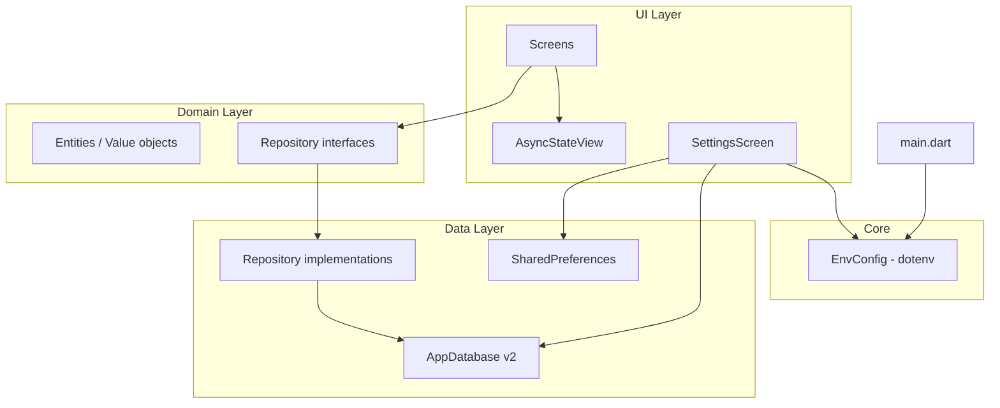

# Sprint 2: Domain, UX & Settings

## Mục tiêu sprint

Biến demo Sprint 1 thành **feature module có cấu trúc**, chuẩn hóa cách hiển thị loading/error, hoàn thiện màn **Settings**, và nâng cấp database (migration + backup). Sprint này vẫn giữ scope offline-first — chưa làm auth hay sync cloud.

**Phụ thuộc:** Sprint 1 hoàn thành ([`sprint-1-core-router-sqlite.md`](sprint-1-core-router-sqlite.md)).

## Phạm vi

| Trong scope | Ngoài scope |
|-------------|-------------|
| Domain entities + repository interface | Auth / đăng nhập |
| Drift migration v1 → v2 | Sync server / API |
| AsyncStateView widget dùng chung | Push notifications |
| Settings: theme, DB info, export, clear | Multi-user |
| Onboarding redirect (lần đầu mở app) | i18n đầy đủ |
| Đọc file `.env` (API URL, app env, feature flags) | Secrets production / CI secrets |

## Kiến trúc mục tiêu



## Quyết định thiết kế

| Hạng mục | Lựa chọn |
|----------|----------|
| Domain model | `Item` entity (id, title, description, createdAt, updatedAt) |
| Migration | Drift `schemaVersion: 2`, `onUpgrade` thêm cột `description`, `updatedAt` |
| Local prefs | `shared_preferences` — onboarding done, theme mode |
| Theme | Riverpod `themeModeProvider` + `FThemes` light/dark toggle trong Settings |
| Export DB | Copy `app.sqlite` ra file user chọn (`file_picker` hoặc share sheet) |
| Async UI | `AsyncStateView<T>` bọc `AsyncValue` — loading / error / empty / data |
| Env / config | `flutter_dotenv` — load `.env` lúc khởi động, expose qua `EnvConfig` + `envProvider` |

## Cấu trúc thư mục (bổ sung)

```
lib/
├── core/
│   ├── config/
│   │   ├── env_config.dart        # typed accessor cho biến env
│   │   └── env.dart               # load + validate .env
│   ├── database/              # schema v2, migrations/
│   ├── preferences/           # app_preferences.dart
│   └── widgets/
│       └── async_state_view.dart
├── domain/
│   ├── entities/
│   │   └── item.dart          # pure Dart entity
│   └── repositories/
│       └── item_repository.dart # abstract interface
├── data/
│   └── repositories/
│       └── item_repository_impl.dart
├── features/
│   ├── items/                 # cập nhật CRUD + edit description
│   ├── onboarding/            # màn chào lần đầu
│   │   └── onboarding_screen.dart
│   └── settings/
│       ├── settings_screen.dart
│       └── settings_provider.dart
└── providers/
    ├── env_provider.dart
    ├── theme_provider.dart
    └── onboarding_provider.dart
```

**File env ở root project:**

```
.env                 # local only — KHÔNG commit (đã có trong .gitignore)
.env.example         # template commit vào git — không chứa secret thật
```

Khai báo asset trong `pubspec.yaml`:

```yaml
flutter:
  assets:
    - .env
```

## Chi tiết từng hạng mục

### 1. Domain layer

Tách entity khỏi Drift generated class:

```dart
// domain/entities/item.dart
class Item {
  const Item({
    required this.id,
    required this.title,
    this.description,
    required this.createdAt,
    required this.updatedAt,
  });

  final int id;
  final String title;
  final String? description;
  final DateTime createdAt;
  final DateTime updatedAt;
}
```

Repository interface:

```dart
abstract class ItemRepository {
  Stream<List<Item>> watchAll();
  Future<Item?> getById(int id);
  Future<int> create({required String title, String? description});
  Future<void> update(Item item);
  Future<void> delete(int id);
}
```

`ItemRepositoryImpl` map `drift.Item` ↔ `domain.Item`.

### 2. Environment config (`.env`)

Load biến môi trường **trước** `runApp`, inject qua Riverpod để feature sau dùng API URL / feature flags mà không hard-code.

**`.env.example`** (commit vào repo):

```env
APP_ENV=development
API_BASE_URL=https://api.example.com
ENABLE_DEBUG_LOG=true
```

**Khởi động trong `main.dart`:**

```dart
Future<void> main() async {
  WidgetsFlutterBinding.ensureInitialized();
  await loadEnv(); // dotenv.load(fileName: '.env')
  registerPathProvider();
  runApp(const ProviderScope(child: Application()));
}
```

**`EnvConfig`** — typed accessor, fail-fast nếu thiếu key bắt buộc:

```dart
class EnvConfig {
  const EnvConfig({
    required this.appEnv,
    required this.apiBaseUrl,
    required this.enableDebugLog,
  });

  final String appEnv;       // development | staging | production
  final String apiBaseUrl;
  final bool enableDebugLog;

  factory EnvConfig.fromDotenv() {
    final env = dotenv.env;
    return EnvConfig(
      appEnv: env['APP_ENV'] ?? 'development',
      apiBaseUrl: env['API_BASE_URL'] ?? '',
      enableDebugLog: env['ENABLE_DEBUG_LOG'] == 'true',
    );
  }

  bool get isProduction => appEnv == 'production';
  bool get isDevelopment => appEnv == 'development';
}
```

**Riverpod:**

```dart
final envProvider = Provider<EnvConfig>((ref) => EnvConfig.fromDotenv());
```

**Sử dụng:**
- `ref.watch(envProvider).apiBaseUrl` — chuẩn bị cho API client Sprint 3
- Settings (debug): hiển thị `APP_ENV`, ẩn khi `isProduction`
- `if (env.enableDebugLog) debugPrint(...)` — log có điều kiện

**Quy tắc bảo mật:**
- `.env` thêm vào `.gitignore`; chỉ commit `.env.example`
- Không đặt API key / secret production trong `.env` commit được — dùng CI inject hoặc secure storage sau
- Mỗi dev copy `.env.example` → `.env` và điền giá trị local

### 3. Database migration v2

```dart
// tables/items.dart — thêm cột
TextColumn get description => text().nullable()();
DateTimeColumn get updatedAt => dateTime().withDefault(currentDateAndTime)();
```

```dart
@override
int get schemaVersion => 2;

@override
MigrationStrategy get migration => MigrationStrategy(
  onCreate: (m) async => m.createAll(),
  onUpgrade: (m, from, to) async {
    if (from < 2) {
      await m.addColumn(items, items.description);
      await m.addColumn(items, items.updatedAt);
    }
  },
);
```

### 4. AsyncStateView (UX pattern)

Widget dùng chung cho mọi `AsyncValue`:

```dart
AsyncStateView<List<Item>>(
  value: ref.watch(itemsStreamProvider),
  empty: () => const EmptyItemsView(),
  data: (items) => ItemsList(items: items),
)
```

- **loading:** `FProgress` centered
- **error:** `FAlert` destructive + nút Retry (`ref.invalidate`)
- **empty:** message tùy feature
- **data:** builder nhận data đã unwrap

Áp dụng tại `ItemsScreen`, `ItemDetailScreen`.

### 5. Items feature — nâng cấp CRUD

| Thay đổi | Chi tiết |
|----------|----------|
| Create | Thêm field `description` (optional) |
| Update | Edit title + description trên `ItemDetailScreen` |
| Delete | Giữ nút delete, thêm confirm `FDialog` |
| Validation | Title bắt buộc, max 200 ký tự |

Route giữ nguyên `/items`, `/items/:id`.

### 6. Settings screen

| Mục | Hành vi |
|-----|---------|
| Theme | Switch light / dark / system — cập nhật `themeModeProvider`, rebuild `Application` theme |
| Environment | Hiển thị `APP_ENV`, `API_BASE_URL` (chỉ khi không phải production) |
| Database | Hiển thị path file DB, số record items |
| Export | Copy `app.sqlite` → user chọn vị trí lưu |
| Clear data | `FDialog` xác nhận → `DELETE FROM items` hoặc drop/recreate |
| Version | Hiển thị `package_info_plus` version |

### 7. Onboarding + GoRouter redirect

```dart
// shared_preferences key: onboarding_completed

redirect: (context, state) {
  final completed = ref.read(onboardingCompletedProvider);
  final onOnboarding = state.matchedLocation == AppRoutes.onboarding;
  if (!completed && !onOnboarding) return AppRoutes.onboarding;
  if (completed && onOnboarding) return AppRoutes.home;
  return null;
},
```

Route mới:

| Path | Màn hình |
|------|----------|
| `/onboarding` | `OnboardingScreen` — 1–2 slide + nút "Bắt đầu" |

`refreshListenable` hoặc `ref.listen` để router re-evaluate redirect khi onboarding hoàn thành.

### 8. Dependencies mới

[`pubspec.yaml`](../../pubspec.yaml):

```yaml
dependencies:
  flutter_dotenv: ^5.x        # đọc file .env
  shared_preferences: ^2.x
  file_picker: ^8.x          # export DB (desktop/mobile)
  share_plus: ^10.x          # share file (mobile fallback)
  package_info_plus: ^8.x    # app version trong Settings

dev_dependencies:
  # giữ drift_dev, build_runner
```

## Phân chia sprint (5 ngày)

### Ngày 1 — Domain + migration + env
- Tạo `domain/entities`, `domain/repositories`
- Implement `ItemRepositoryImpl`, cập nhật providers
- Migration Drift v2, chạy `build_runner`
- Setup `flutter_dotenv`: `.env.example`, `loadEnv()`, `EnvConfig`, `envProvider`
- Gọi `await loadEnv()` trong `main()` trước `runApp`
- Test migration: tạo DB v1 in-memory → upgrade → verify cột mới

**Done khi:** existing data migrate không mất, `envProvider` đọc được `APP_ENV`, test pass.

### Ngày 2 — AsyncStateView + Items CRUD
- `core/widgets/async_state_view.dart`
- Refactor `ItemsScreen`, `ItemDetailScreen` dùng AsyncStateView
- Thêm edit description, confirm delete dialog
- Form validation với `FTextField`

**Done khi:** CRUD đầy đủ với description, UI error/loading nhất quán.

### Ngày 3 — Settings
- `shared_preferences` + `settings_provider`
- Theme toggle (light/dark) wired vào `app.dart`
- DB info, export file, clear data
- Hiển thị env info (`APP_ENV`) trong Settings (ẩn ở production)
- `package_info_plus` hiển thị version

**Done khi:** đổi theme persist sau restart, export ra file `.sqlite` thành công.

### Ngày 4 — Onboarding + router
- `OnboardingScreen` + route `/onboarding`
- `redirect` logic trong `app_router.dart`
- Error route `/error` (optional fallback UI)

**Done khi:** lần đầu mở app → onboarding → home; lần sau bỏ qua onboarding.

### Ngày 5 — Polish & test
- Unit test: migration, repository mapping, `EnvConfig.fromDotenv`
- Widget test: Settings theme toggle, onboarding flow
- `flutter analyze` + `flutter test`
- Cập nhật [`README.md`](../../README.md) và [`.cursor/skills/flutter-forui/SKILL.md`](../../.cursor/skills/flutter-forui/SKILL.md)

**Done khi:** CI-local green.

## Rủi ro & lưu ý

- **Migration:** luôn test `from == 1` trên DB thật trước khi ship; backup trước khi clear data.
- **Export trên iOS:** cần share sheet (`share_plus`) vì sandbox hạn chế ghi file tùy ý.
- **Theme toggle:** ForUI có `.light` / `.dark` — cần rebuild `FThemeData` trong `Application`, không chỉ `ThemeMode`.
- **Router redirect:** `GoRouter` cần recreate hoặc `refreshListenable` khi prefs thay đổi.
- **`.env`:** file phải khai báo trong `pubspec.yaml` assets; sau khi sửa `.env` cần **full restart** (hot reload không reload asset). Đảm bảo `.env` trong `.gitignore`.
- **CI/build:** có thể copy `.env.example` → `.env` trong script build, hoặc inject biến qua `--dart-define` ở sprint sau nếu cần.

## Tiêu chí hoàn thành (Definition of Done)

- [x] Domain entity + repository interface tách khỏi Drift
- [x] Drift schema v2 migrate từ v1 không mất data
- [x] `.env` load lúc startup, `EnvConfig` + `envProvider` hoạt động
- [x] `.env.example` committed, `.env` ignored
- [x] `AsyncStateView` dùng ở ít nhất 2 màn hình
- [x] Items: create/read/update/delete với `description`
- [x] Settings: theme, DB info, export, clear data
- [x] Onboarding redirect hoạt động
- [x] `flutter analyze` + `flutter test` pass

## Sprint 3 (preview)

- Domain tables mới (feature chính của app — thay `items` nếu cần)
- Search / filter / sort
- `go_router` nested navigation cho sub-features
- Import DB (restore từ file export)
